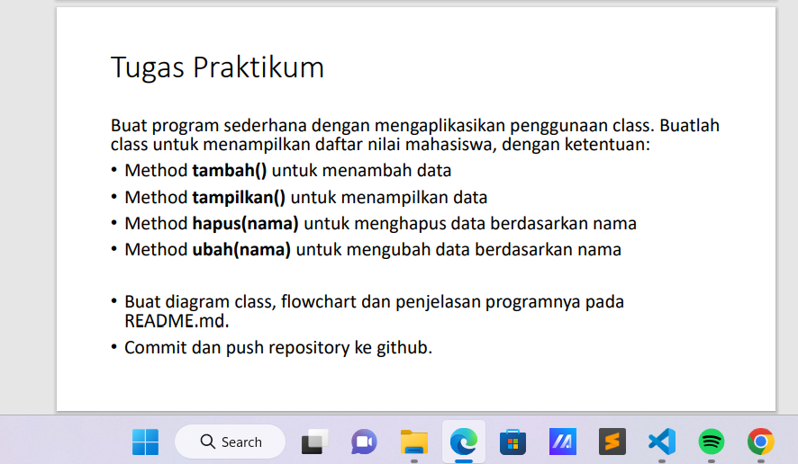
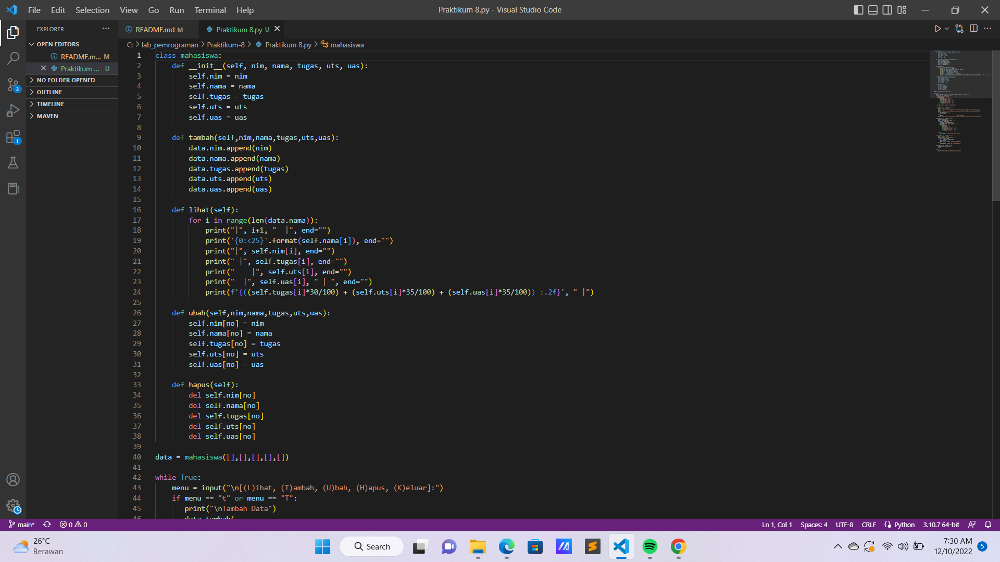
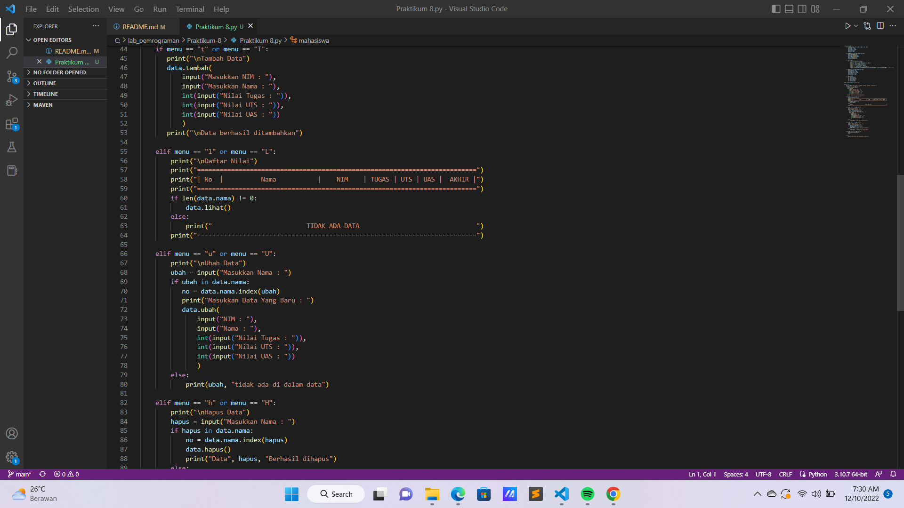
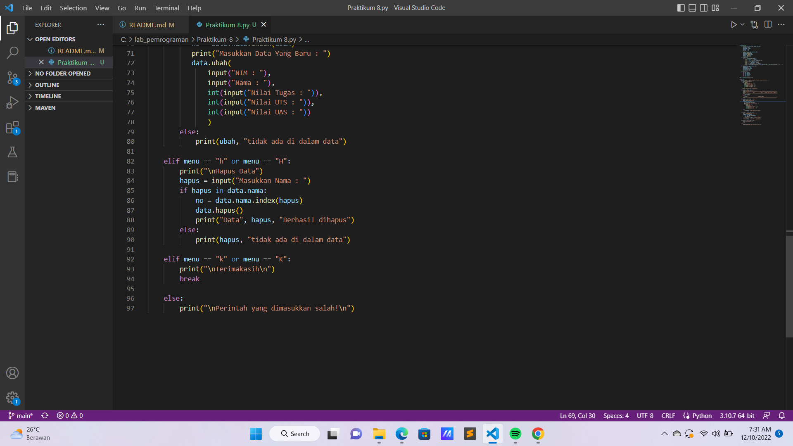
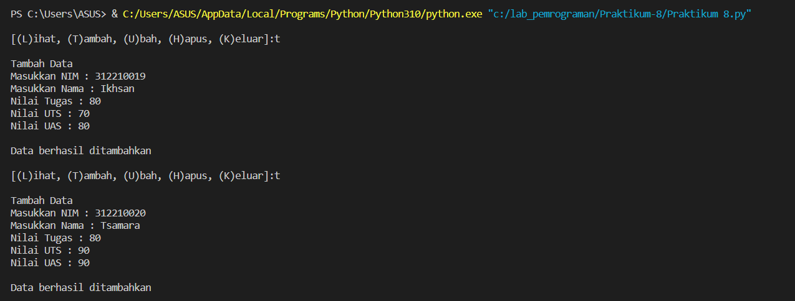
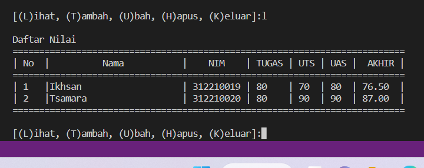
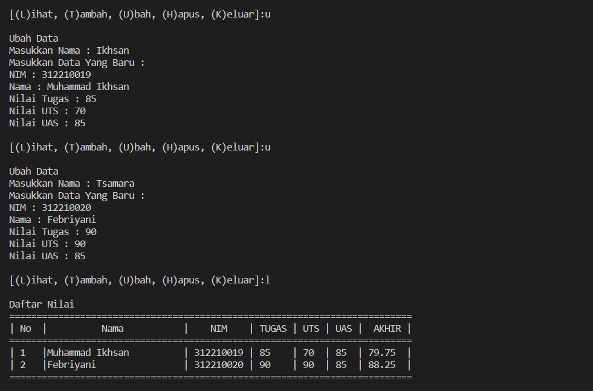
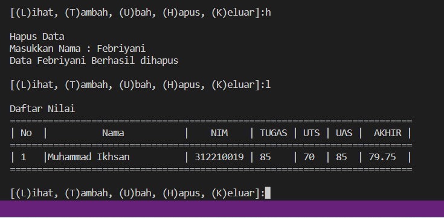

# Tugas Praktikum {Pertemuan ke 12}  

|**Nama**|**NIM**|**Kelas**|**Matkul**|
|----|---|-----|------|
|Muhammad Ikhsan Fakhrudin|312210019|TI.22.A2|Pemrograman|

# Tugas Praktikum 



# Kode Program







# Penjelasan

Pertama kita mendeklarasikan sebuah class Mahasiswa yang didalamnya terdapat atribut NIM, Nama, nilai tugas, nilai UTS dan nilai UAS.

Jangan lupa, untuk mendeklarasikan sebuah class didalam OOP kita harus gunakan **def__init__ dan juga self.**
```
class mahasiswa:
    def __init__(self, nim, nama, tugas, uts, uas):
        self.nim = nim
        self.nama = nama
        self.tugas = tugas
        self.uts = uts
        self.uas = uas
```

Seperti biasa, deklarasikan satu dictionary kosong sebagai tempat menyimpan data-data yang sudah kita input. Ada 5 list kosong yang nanti isinya yaitu NIM, Nama, nilai tugas, nilai UTS dan nilai UAS.
```
data = mahasiswa([],[],[],[],[])
```

Kita akan buat beberapa method untuk menambahkan, menampilkan, menghapus, mengubah data mahasiswa. Pertama membuat method tambah(), method ini berfungsi untuk menambahkan data. Dalam method ini kita menggunakan append() supaya data yang terakhir ditambahkan, ada di urutan list paling akhir.
```
def tambah(self,nim,nama,tugas,uts,uas):
        data.nim.append(nim)
        data.nama.append(nama)
        data.tugas.append(tugas)
        data.uts.append(uts)
        data.uas.append(uas)
```

Ini tampilan jika kita memanggil method **Tambah()** :



Membuat method lihat(), gunanya untuk menampilkan seluruh data yang sudah kita tambahkan tadi. Kalau tidak ada data sama sekali, maka akan muncul tulisan **TIDAK ADA DATA**.
```
def lihat(self):
        for i in range(len(data.nama)):
            print("|", i+1, "  |", end="")
            print('{0:<25}'.format(self.nama[i]), end="")
            print("|", self.nim[i], end="")
            print(" |", self.tugas[i], end="")
            print("    |", self.uts[i], end="")
            print("  |", self.uas[i], " | ", end="")
            print(f'{((self.tugas[i]*30/100) + (self.uts[i]*35/100) + (self.uas[i]*35/100)) :.2f}', " |")
```

Ini tampilan jika kita memanggil method **lihat()** :



Membuat method ubah() yang fungsinya untuk mengubah data. jika method ini dipanggil, maka data Nama, NIM, nilai tugas, nilai UTS, nilai UAS index nomor - (no) akan diubah sesuai dengan inputan dari user. Index ke - (no) akan dicari secara otomatis sesuai dengan nama yang ingin diubah oleh user.
```
def ubah(self,nim,nama,tugas,uts,uas):
        self.nim[no] = nim
        self.nama[no] = nama
        self.tugas[no] = tugas
        self.uts[no] = uts
        self.uas[no] = uas
```

Ini tampilan jika kita memanggil method **Ubah()** :



Terakhir kita buat method hapus(). Gunanya adalah menghapus data berdasarkan nama. Kita bisa menggunakan del untuk menghapus datanya. Seperti tadi, nomor index list yang akan dihapus disesuaikan dengan inputan dari user. Yaitu index nomor ke - (no).
```
def hapus(self):
        del self.nim[no]
        del self.nama[no]
        del self.tugas[no]
        del self.uts[no]
        del self.uas[no]
```

Ini tampilan jika kita memanggil method **Hapus()** :



# Flowchart


